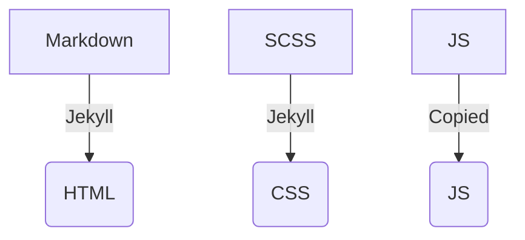

# Test Site

## Serving the webpage locally

To view the website before publishing, and also see our changes, we can set up a "development server"
that renders the page as we make changes.

- open the Terminal
- use `cd` to change directories to the repository
  - eg. `cd git/test_site`
- start the development server
  - `bundle exec jekyll serve`
  - Optionally, you can add additional arguments to change the way the server works, to see those
    type `bundle exec jekyll serve --help`
  - For example, to open your browser and get the page to automatically reload once you make changes, you can use
    `bundle exec jekyll serve --livereload --open`
- Open the site directory in your text editor! Either by 
  - opening Sublime Text and using the `File > Open` menu, or
  - typing `subl .` from the site directory in the Terminal
- Now when you edit files in the site, you should see that reflected on the page served by the development server!
  - Usually served at [http://127.0.0.1:4000/test_site/](http://127.0.0.1:4000/test_site/)
  
# Project Organization

(also see https://jekyllrb.com/docs/ )



- Markdown serves as the source for the HTML that is produced
  - Jekyll uses templates (specified in the "frontmatter" at the top of a markdown file) to build the page. These are stored in
    - `_layouts`: full page page templates that can be specified with the `layout` parameter
    - `_includes`: Smaller HTML fragments that can be reused (see [Includes Documentation](https://jekyllrb.com/docs/includes/))
- CSS controls the appearance of the objects on the page
  - Use [CSS Selectors](https://www.w3schools.com/cssref/css_selectors.asp) to specify *which* elements you are styling
  - Use [CSS Rules](https://developer.mozilla.org/en-US/docs/Web/CSS/Reference) to apply a style
  - For example:
    ```css
    // Select the "home" class
    .home {
      // change the color
      color: red;
    }
    ```
  - Jekyll uses an "enhanced" CSS syntax that makes some parts of writing CSS easier, unhelpfully there are two that you can use, determined  by the 
    - SCSS: more like base CSS, easier to transition
    - SASS: a little bit cleanear syntax, but harder to use online documentation that you might find.
    
# Basic git workflow

Git can be a complicated tool! but using it consists of just a few basic steps. We can start by describing some basic concepts

- `commit`

## Getting Started

- Open terminal
- go to test_site directory with `cd`
- `git pull` to pull in any changes from the remote version of the code that might have happened since last you worked on things
- start dev server (described above)
- Open text editor 
  - from command line, use `Cmd + t` to open new tab, and then `subl .` to open the current directory in sublime text)
  - Or open sublime text from `/Applications` and manually open with `File > Open`
- Make changes to site

## After Making Changes

- `git status` - see the status of what has been changed, do this whenever you aren't sure what's going on with the repository to see what's been changed or staged for committing.
- `git add .` - Add all files in the current directory to the next commit, or "stage" the changes
  - You don't have to use `.` and can instead specify specific files or directories if you don't want to commit all of your changes like `git add filename.md`
- `git commit -m "commit description"` - Make a *commit* of your code, or create a checkpoint of the code at the particular point in time.
- `git push` - send my commit to github

You might run into a "merge conflict" here where the server has different commits than you do on your local version, eg. if you were editing in the web editor, committed, but then didn't pull those changes to the local copy before doing additional work. To get past this:

- `git pull` to pull any changes from the server. 
- If there are no conflicts that can't be automatically resolved, then you will be greeted with a horrifying `vim` prompt, to exit this (and complete the merge) type `:q` and then press `enter`.
- `git push` again
    
# Deploying

Building the website and making it available online

# Components of development environment

- text editor
- jekyll
- git
- github

# Helpful terminal commands

- `ctrl+c` - close running process
- `up arrow` - get the last command that was issued
    
# References

- Using CSS: https://developer.mozilla.org/en-US/docs/Learn/Getting_started_with_the_web/CSS_basics
- Learning git visually: https://learngitbranching.js.org/

                                                                                                                                                                                                                                                                                                                                                                                                                                                                                                                                                                                                                                                                                                                                                                                                                                                                                                                                                                                                                                                                                                                                                                                                                                                                                                                                                                                                                                                                                                        
