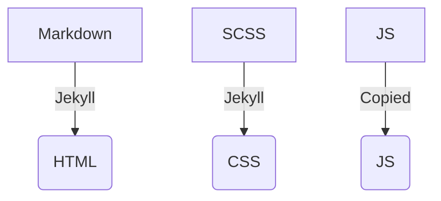

# Test Site

## Serving the webpage locally

To view the website before publishing, and also see our changes, we can set up a "development server"
that renders the page as we make changes.

- open the Terminal
- use `cd` to change directories to the repository
  - eg. `cd git/test_site`
- start the development server
  - `bundle exec jekyll serve`
  - Optionally, you can add additional arguments to change the way the server works, to see those
    type `bundle exec jekyll serve --help`
  - For example, to get the page to automatically reload once you make changes, you can use
    `bundle exec jekyll serve --livereload`
- Open the site directory in your text editor! Either by 
  - opening Sublime Text and using the `File > Open` menu, or
  - typing `subl .` from the site directory in the Terminal
- Now when you edit files in the site, you should see that reflected on the page served by the development server!
  - Usually served at [http://127.0.0.1:4000/test_site/](http://127.0.0.1:4000/test_site/)
  
# Project Organization

(also see https://jekyllrb.com/docs/ )



- Markdown serves as the source for the HTML that is produced
  - Jekyll uses templates (specified in the "frontmatter" at the top of a markdown file) to build the page. These are stored in
    - `_layouts`: full page page templates that can be specified with the `layout` parameter
    - `_includes`: Smaller HTML fragments that can be reused (see [Includes Documentation](https://jekyllrb.com/docs/includes/))
- CSS controls the appearance of the objects on the page
  - Use [CSS Selectors](https://www.w3schools.com/cssref/css_selectors.asp) to specify *which* elements you are styling
  - Use [CSS Rules](https://developer.mozilla.org/en-US/docs/Web/CSS/Reference) to apply a style
  - For example:
    ```css
    // Select the "home" class
    .home {
      // change the color
      color: red;
    }
    ```
  - Jekyll uses an "enhanced" CSS syntax that makes some parts of writing CSS easier, unhelpfully there are two that you can use, determined  by the 
    - SCSS: more like base CSS, easier to transition
    - SASS: a little bit cleanear syntax, but harder to use online documentation that you might find.
    
# Basic git workflow

Git can be a complicated tool! but using it consists of just a few basic steps. We can start by describing some basic concepts

- `commit`
- ``
    
# Deploying

Building the website and making it available online

# Components of development environment

- text editor
- jekyll
- git
- github

# Helpful terminal commands

- `ctrl+c` - close running process
- `up arrow` - get the last command that was issued
    
# References

- Using CSS: https://developer.mozilla.org/en-US/docs/Learn/Getting_started_with_the_web/CSS_basics
- Learning git visually: https://learngitbranching.js.org/

                                                                                                                                                                                                                                                                                                                                                                                                                                                                                                                                                                                                                                                                                                                                                                                                                                                                                                                                                                                                                                                                                                                                                                                                                                                                                                                                                                                                                                                                                                        
